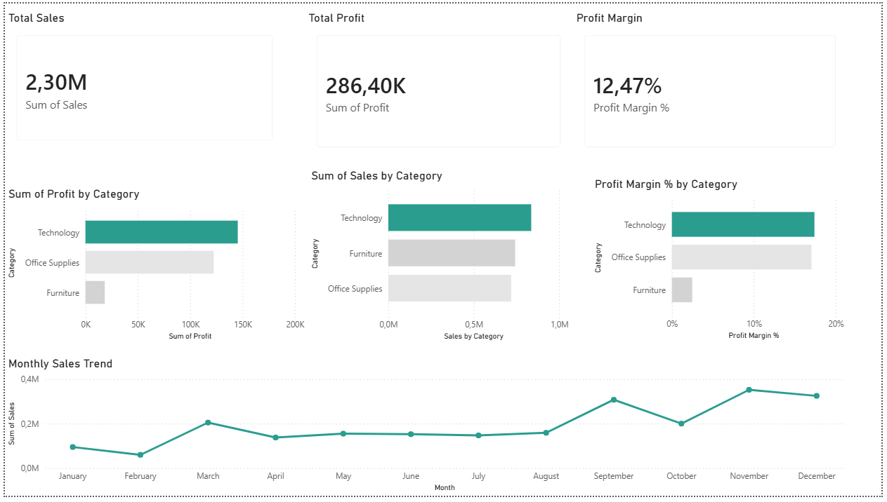

# 📊 Sales & Profit Analysis (SQL + Power BI)

This project analyzes retail sales data to identify revenue drivers, profitability patterns, and performance trends.  

It combines **SQL for data analysis** and **Power BI for visualization**, demonstrating an end-to-end workflow from raw data to business insights.

---

## 📁 Dataset
- Source: Superstore Sales Dataset (Kaggle)  
- ~10,000 transactions  
- Includes:
  - Sales, Profit, Quantity  
  - Category & Sub-category  
  - Customer details  
  - Order and shipping dates  

---

## ⚙️ Tools Used

**Data Analysis**
- PostgreSQL (pgAdmin)
- SQL (aggregations, CTEs, window functions)

**Data Visualization**
- Power BI
- DAX (measures and KPIs)

---

## 🔍 SQL Analysis

### Revenue by Category
Technology generates the highest revenue, followed by Furniture and Office Supplies.

### Profitability by Category
Technology is the most profitable category, while Furniture shows significantly weaker profit performance.

### Top Customers
Using window functions (`RANK()`), a small group of customers was identified as contributing a large share of total revenue.

### Customer Profitability
Some high-spending customers operate at negative profit margins, indicating inefficiencies such as discounting or high servicing costs.

### Monthly Sales Trends
Sales show clear seasonality, with stronger performance toward the end of the year.

---

## 📊 Power BI Dashboard

The Power BI dashboard translates the SQL analysis into a visual, interactive format.

### Key Components
- KPI Cards: Total Sales, Total Profit, Profit Margin  
- Sales by Category  
- Profit by Category  
- Profit Margin by Category  
- Monthly Sales Trend  

---

## 📷 Dashboard Preview

This dashboard highlights key performance metrics and trends across sales, profit, and category performance.

---

## 📄 Download Full Dashboard
[View Dashboard (PDF)](Sales_Profit_Dashboard_PowerBI.pdf)

---

## 🔍 Key Insights

- Technology is the strongest-performing category across both sales and profit  
- Furniture underperforms, particularly in profitability  
- Profit margin varies significantly, showing that high sales do not always translate to efficiency  
- Sales increase toward year-end, with a clear peak in Q4  

---

## 🧠 Skills Demonstrated

- Data cleaning and structuring  
- SQL querying (aggregations, window functions)  
- DAX measure creation (Profit Margin %)  
- Data visualization and dashboard design  
- Translating data into business insights  

---

## 📂 Project Structure
